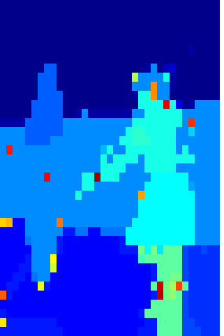

# Coarse Segmentation
## Coarse Segmentation With GDD Clustering Using Color and Spatial Data
You can access the paper using the link below:  
https://ieeexplore.ieee.org/document/9163101

 
<strong>Figure 1</strong> - Berkeley Segmentation Dataset 101087 image Coarse Segmentation Color (Left) & Label (Right) Output 

## Properties 
* +No parameter is needed
* +Intersection of two threads are used to obtain final segmentation result which currently segments images based on spatial and color data.
* +Resulting clusters do not change at different runs.
* -Segmentation outputs will  have outlier segments as it can be seen in Figure 1.
* -As clustering algorithm is not optimized for 2D images, run times are rather slow.

### <strong>[Please cite as]:</strong>
>  EGüngör, E., & Özmen, A. (2020). Coarse Segmentation With GDD Clustering Using Color and Spatial Data. IEEE Access, 8, 144880-144891. 

 
You can find test images from 
The Berkeley Segmentation Dataset and Benchmark: 
https://www2.eecs.berkeley.edu/Research/Projects/CS/vision/bsds/

 
 
<strong>Useful links (compared methods included):</strong> 
https://github.com/bonlime/keras-deeplab-v3-plus
 
https://github.com/divamgupta/image-segmentation-keras
